# Latent Space Visualization Lab

A friendly guide for understanding **PCA, SNE, t-SNE, UMAP, and modern latent-space visualization**.

This repo focuses on:

- interactive animations, including 2D and 3D views;
- reproducible PCA/t-SNE/UMAP experiments;
- generated visualizations and GIFs;
- hyperparameter sensitivity on handwritten digits;
- examples from toy geometry, nonlinear dynamics, and handwritten-digit embeddings.


## Visual Highlights

The repo opens with the artifacts, because the fastest way to understand these methods is to see what changes.

### 3D Manifold And Projection Animations

| Swiss Roll: 3D Geometry | Swiss Roll: Collapse To 2D |
| --- | --- |
| 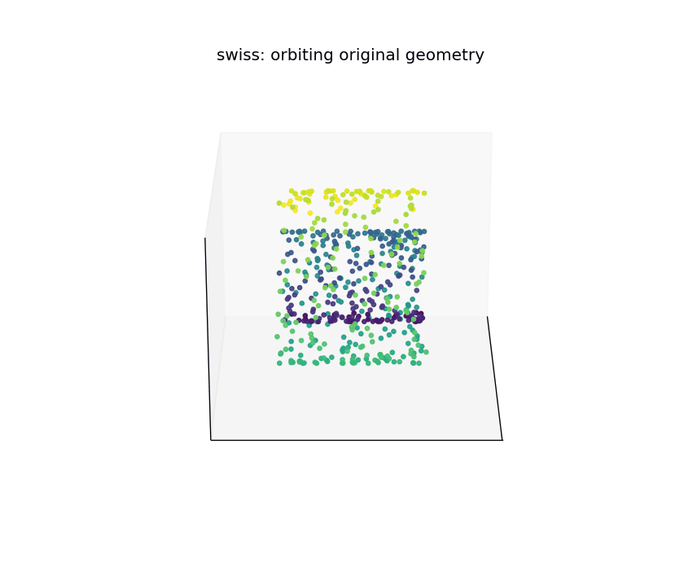 | 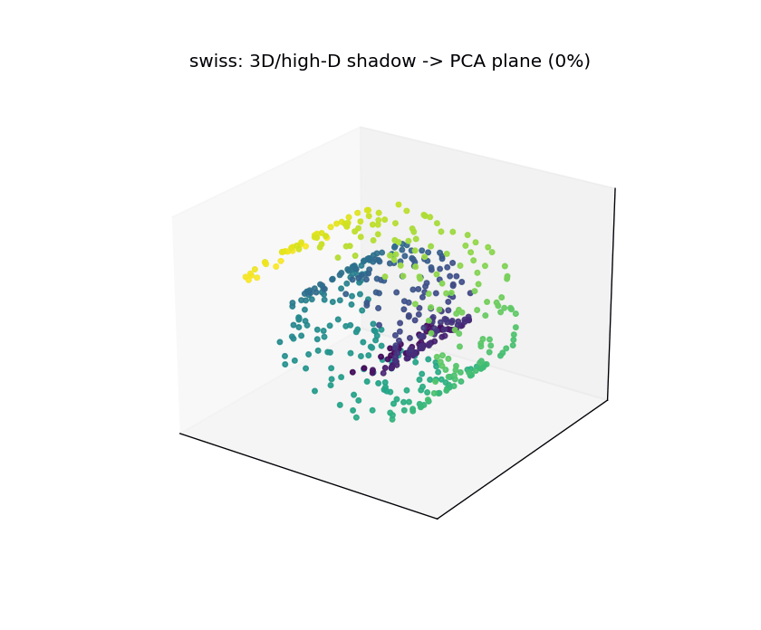 |

| Lorenz Attractor: Dynamical-System Geometry | 4D Hypercube Shadow: Higher-Dimensional Projection |
| --- | --- |
| 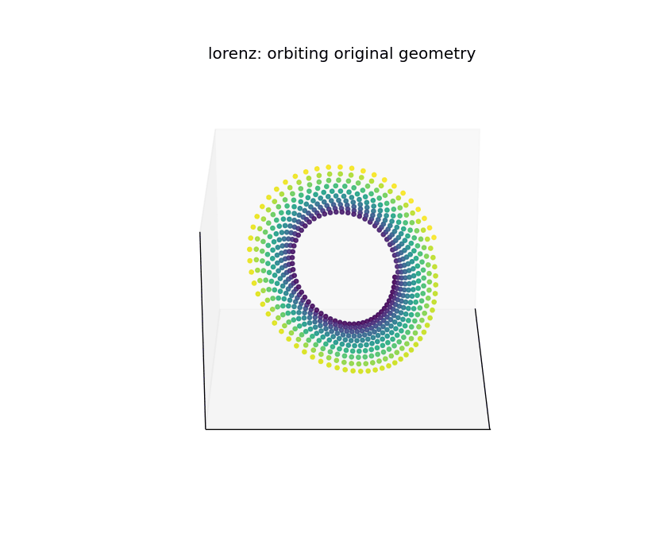 | 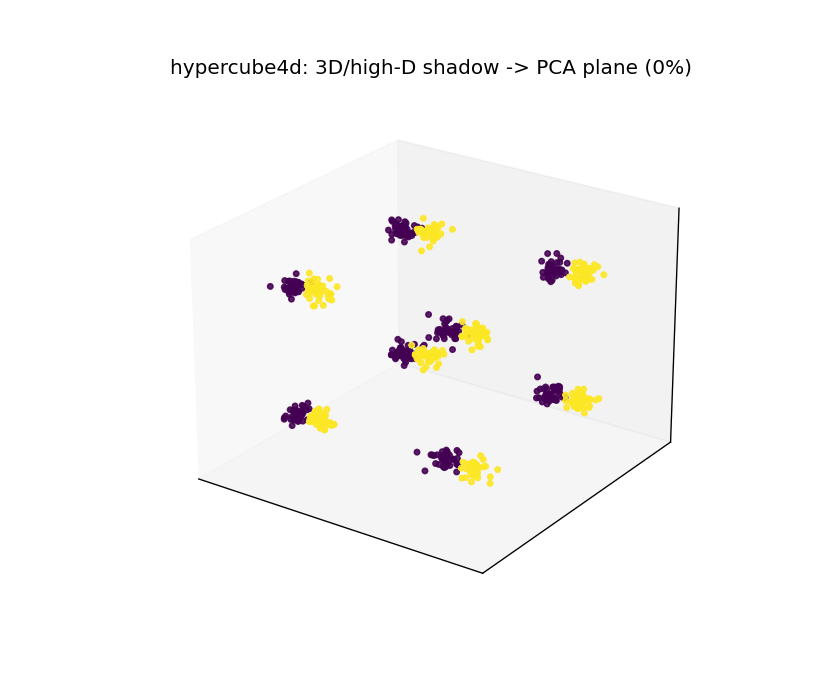 |

### Hyperparameter Sensitivity On Handwritten Digits

| t-SNE Perplexity Sweep | UMAP `n_neighbors` Sweep |
| --- | --- |
| 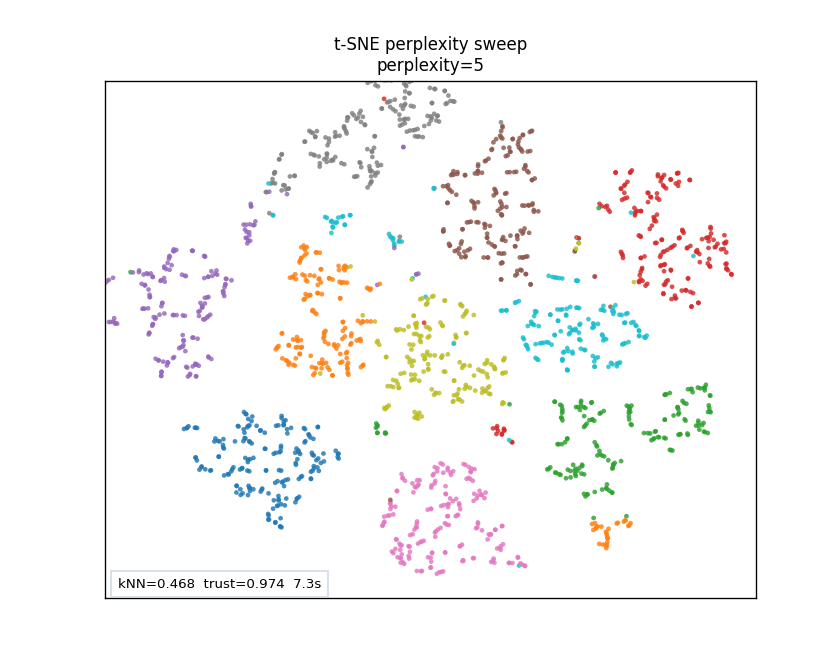 | 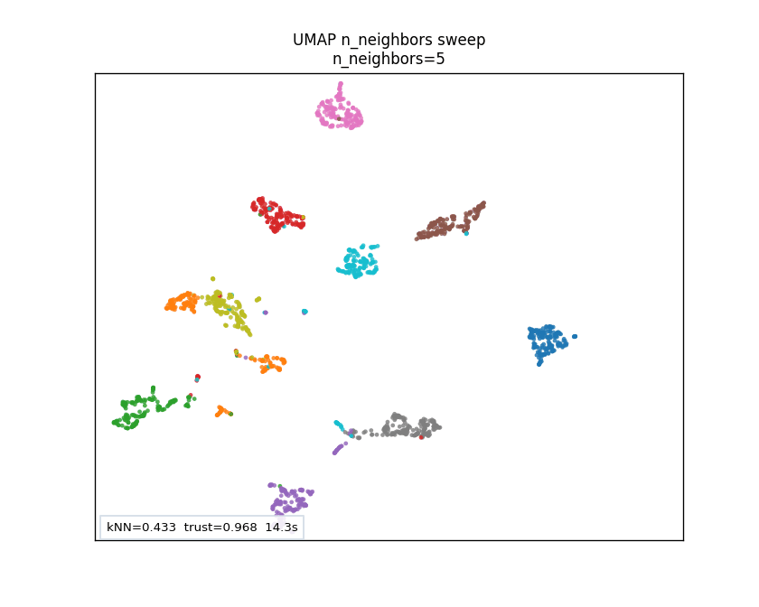 |

### Static Comparison Figures

| UMAP Graph Construction | Digits t-SNE Grid |
| --- | --- |
| 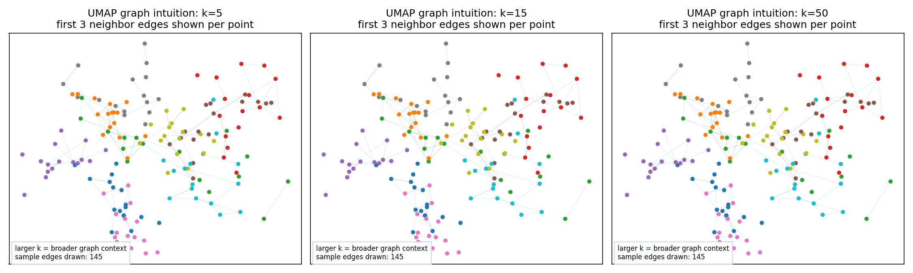 | 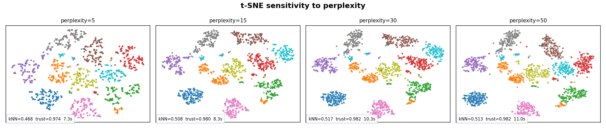 |

### PnP/RED Reconstruction Trajectory Gallery

The gallery below shows representative reconstruction dynamics across forward models, algorithm families, and denoiser profiles. These images are lightweight reproducible demonstrators; the pretrained denoiser runner loads DRUNet, DnCNN, or DiffUNet-style models from DeepInverse at runtime and does not store weights in the repo.

| Cross-Case Reconstruction Overview | Gaussian Deblur Residual Trajectories |
| --- | --- |
| 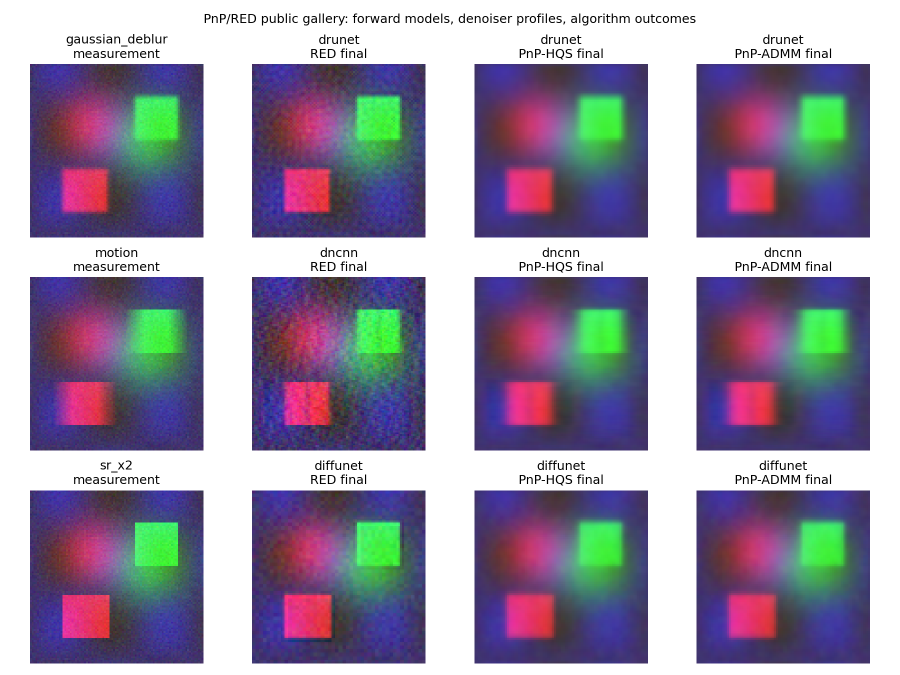 | 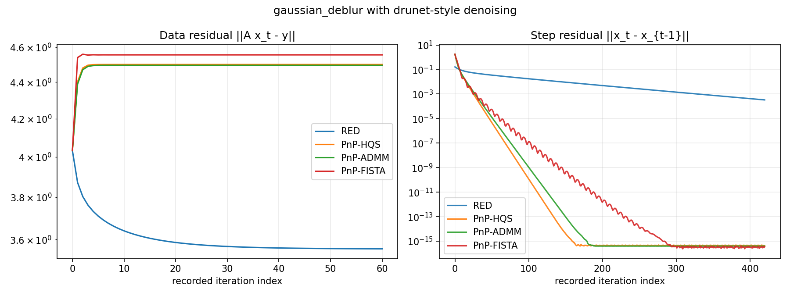 |

| Gaussian Deblur Trajectory Embedding | Super-Resolution Trajectory Embedding |
| --- | --- |
| 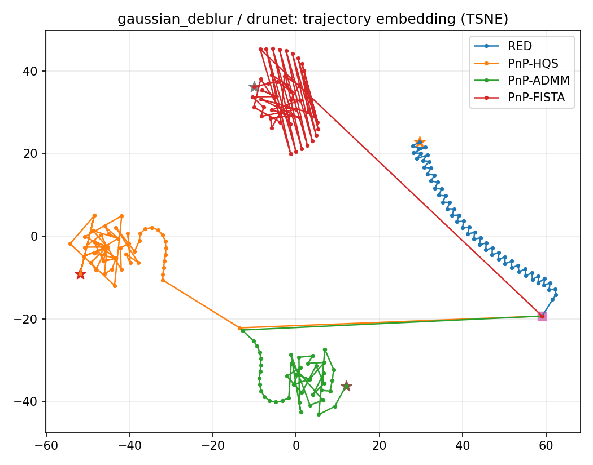 | 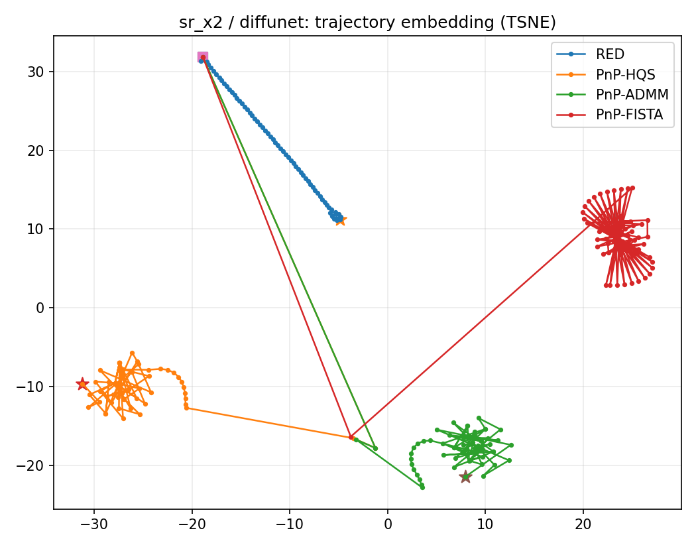 |

For the full interactive experience, run a local server and open:

- `index.html` for algorithm animations;
- `visual3d.html` for 3D and higher-dimensional projection geometry;
- `dashboard.html` for side-by-side method comparison.

## Quick Start

Open the interactive animation lab:

```text
index.html
```

For the comparison dashboard, start a local server:

```bash
python -m http.server 8000
```

Then visit:

```text
http://localhost:8000/dashboard.html
```

Open the 3D/higher-dimensional visual lab:

```text
http://localhost:8000/visual3d.html
```

## What Is Included

### Interactive Tools

- `index.html`: animated PCA, SNE, t-SNE, and UMAP intuition lab.
- `dashboard.html`: side-by-side comparison dashboard for generated handwritten-digit embeddings.
- `visual3d.html`: orbitable 3D and higher-dimensional projection lab.

### Guides

- `docs/theory_guide.md`: PCA, SNE, t-SNE, UMAP, TriMap, and PaCMAP theory.
- `docs/comparison_guide.md`: hyperparameter sensitivity, timing, metrics, and UMAP graph intuition.
- `docs/pnp_red_trajectory_guide.md`: optional PnP/RED trajectory visualization with DeepInverse denoisers.
- `latent_space_visualization_tutorial.md`: beginner-friendly tutorial.

### Generated Results

- `results_canonical/`: rings and Lorenz attractor PCA/t-SNE/UMAP results.
- `results_digits/`: handwritten-digits sweeps, GIFs, metrics, and browser-loadable embeddings.
- `results_3d/`: exported 3D rotations, projection comparisons, and 3D-to-2D collapse GIFs.
- `results_pnp_red_gallery/`: PnP/RED reconstruction snapshots, residual trajectories, and trajectory embeddings.

### Reproducible Scripts

- `scripts/generate_canonical_results.py`
- `scripts/generate_digits_sensitivity.py`
- `scripts/generate_3d_artifacts.py`
- `scripts/generate_pnp_red_gallery.py`
- `scripts/generate_results.js`
- `scripts/run_pnp_red_trajectory.py`

Install dependencies:

```bash
pip install -r requirements.txt
```

Regenerate canonical results:

```bash
python scripts/generate_canonical_results.py
```

Regenerate handwritten-digits sweeps:

```bash
python scripts/generate_digits_sensitivity.py
```

On Windows, if UMAP/Numba needs a local cache:

```powershell
$env:NUMBA_CACHE_DIR="$PWD\.numba_cache"
python scripts\generate_digits_sensitivity.py
```

Regenerate 3D exports:

```bash
python scripts/generate_3d_artifacts.py
```

Regenerate the public PnP/RED visual gallery:

```bash
python scripts/generate_pnp_red_gallery.py
```

Optional PnP/RED reconstruction trajectory demo:

```bash
pip install -r requirements-inverse.txt
python scripts/run_pnp_red_trajectory.py --task gaussian_deblur --denoiser drunet --iters 2000
```

Denoiser weights are loaded at runtime through DeepInverse and are not stored in this repository.

## Learning Path

1. Open `index.html`.
2. Try PCA on Swiss roll.
3. Switch to SNE and t-SNE to see local neighborhoods form.
4. Switch to UMAP and inspect graph links.
5. Open `visual3d.html` and animate 3D-to-2D projection collapse.
6. Open `dashboard.html` and compare PCA, t-SNE, and UMAP side by side.
7. Read `docs/comparison_guide.md`.
8. Read `docs/theory_guide.md`.
9. Inspect `results_digits/summary.md` and `results_digits/metrics.csv`.

## 3D and Higher-Dimensional Visual Lab

The 3D lab adds:

- orbit and zoom controls;
- Swiss roll, Lorenz attractor, helix, nested rings, and 4D hypercube shadow;
- PCA, random, and radial 2D projection targets;
- k-nearest-neighbor graph edges;
- projection trails;
- animated collapse from original geometry to a 2D projection.

This is the best page for understanding the geometric difference between:

```text
the object itself
the shadow we see
the projection method we choose
```

Exported 3D artifacts:

- `results_3d/swiss_3d_rotation.gif`
- `results_3d/swiss_collapse_to_2d.gif`
- `results_3d/lorenz_3d_rotation.gif`
- `results_3d/lorenz_collapse_to_2d.gif`
- `results_3d/hypercube4d_3d_rotation.gif`
- `results_3d/hypercube4d_collapse_to_2d.gif`
- `results_3d/summary.md`

## Current Handwritten-Digits Results

| Method | Hyperparameter | Value | kNN overlap | Trustworthiness |
| --- | --- | ---: | ---: | ---: |
| PCA | n_components | 2 | 0.137 | 0.817 |
| t-SNE | perplexity | 5 | 0.468 | 0.974 |
| t-SNE | perplexity | 15 | 0.508 | 0.980 |
| t-SNE | perplexity | 30 | 0.517 | 0.982 |
| t-SNE | perplexity | 50 | 0.513 | 0.982 |
| UMAP | n_neighbors | 5 | 0.433 | 0.968 |
| UMAP | n_neighbors | 15 | 0.448 | 0.974 |
| UMAP | n_neighbors | 50 | 0.425 | 0.970 |
| UMAP | n_neighbors | 100 | 0.418 | 0.965 |
| UMAP | min_dist | 0.0 | 0.435 | 0.974 |
| UMAP | min_dist | 0.1 | 0.433 | 0.971 |
| UMAP | min_dist | 0.35 | 0.431 | 0.969 |
| UMAP | min_dist | 0.7 | 0.404 | 0.962 |

## Interpretation Rules

- Always ask what the method preserves.
- Always compare against PCA.
- Always sweep important hyperparameters.
- Treat t-SNE/UMAP axes as arbitrary.
- Treat beautiful maps as hypothesis generators, not proof.


## References

- Pearson, K. "On Lines and Planes of Closest Fit to Systems of Points in Space." 1901.
- Hotelling, H. "Analysis of a Complex of Statistical Variables into Principal Components." 1933.
- Hinton, G. E. and Roweis, S. T. "Stochastic Neighbor Embedding." 2002.
- van der Maaten, L. and Hinton, G. "Visualizing Data using t-SNE." JMLR, 2008.
- McInnes, L., Healy, J., and Melville, J. "UMAP: Uniform Manifold Approximation and Projection for Dimension Reduction." 2018.
- Amid, E. and Warmuth, M. K. "TriMap: Large-scale Dimensionality Reduction Using Triplets." 2019.
- Wang, Y., Huang, H., Rudin, C., and Shaposhnik, Y. "Understanding How Dimension Reduction Tools Work..." 2021.
